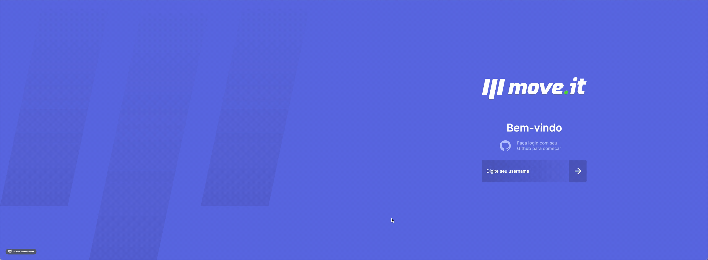
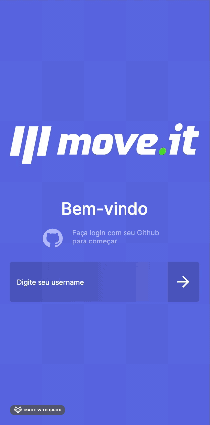

<p align="center">
    
</p>

<p align="center">
  
  
  
  
   
  
</p>

---

## Description: :star:

<p>This project has the objective of helper to the people working at home if exercise.</p>
<p>This project is based on a course of Reactjs by <a href="https://rocketseat.com.br/">Rocketseat</a></p>

---

<p align="center">
  <a href="#demo-red_circle">Demo</a>&nbsp;&nbsp;&nbsp;|&nbsp;&nbsp;&nbsp;
  <a href="#getting-started-rocket">Getting started</a>&nbsp;&nbsp;&nbsp;|&nbsp;&nbsp;&nbsp;
  <a href="#challenges-white_check_mark">Challenges</a>&nbsp;&nbsp;&nbsp;|&nbsp;&nbsp;&nbsp;
  <a href="#technologies-boom">Technologies</a>
</p>

---
## Demo: :red_circle:

**web**


**Mobile**



---

## Getting started: :rocket:
Some environment variables are used in the project, create a file `.env`:
```
MONGODB_URI= your url of database
SECRET_TOKEN= token jwt
```

**install the dependencies:**

```sh
$ npm i or yarn
```

**run in environment development:**

```sh
$ npm run dev or yarn dev
```

**run tests unit:**

```sh
$ npm run test:unit:watch or yarn test:unit:watch
```

**run tests e2e:**

```sh
$ npm run test:e2e or yarn test:e2e
```
This Project run on port `3000`

---

## Challenges: :white_check_mark:

Challenges completed:

- [x] Create page of login
- [x] Create page of leaderboard
- [x] Create a menu to navigate in the application
- [x] Create theme dark
- [x] Create a template responsive
- [x] Create tests unit and e2e

---

## Technologies: :boom:

This project contains those technologies:

- [reactjs](https://reactjs.org/)
- [jestjs](https://jestjs.io/)
- [cypress](https://www.cypress.io/)
- [nextjs](https://nextjs.org/)

---

<br>

Made by Janapc :metal: [Get in touch!](https://www.linkedin.com/in/janaina-pedrina/)
